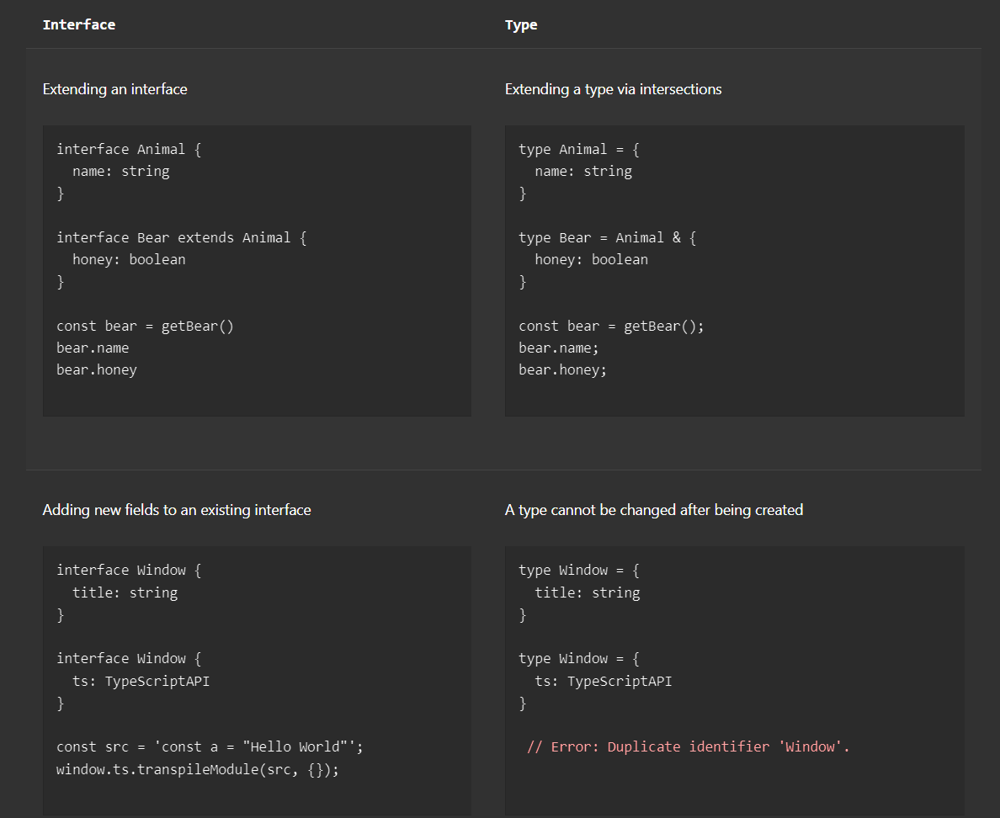

- An interface can extend one or multiple existing interfaces.
- An interface also can extend a class. If the class contains private or protected members, the interface can only be
  implemented by the class or subclasses of that class.
